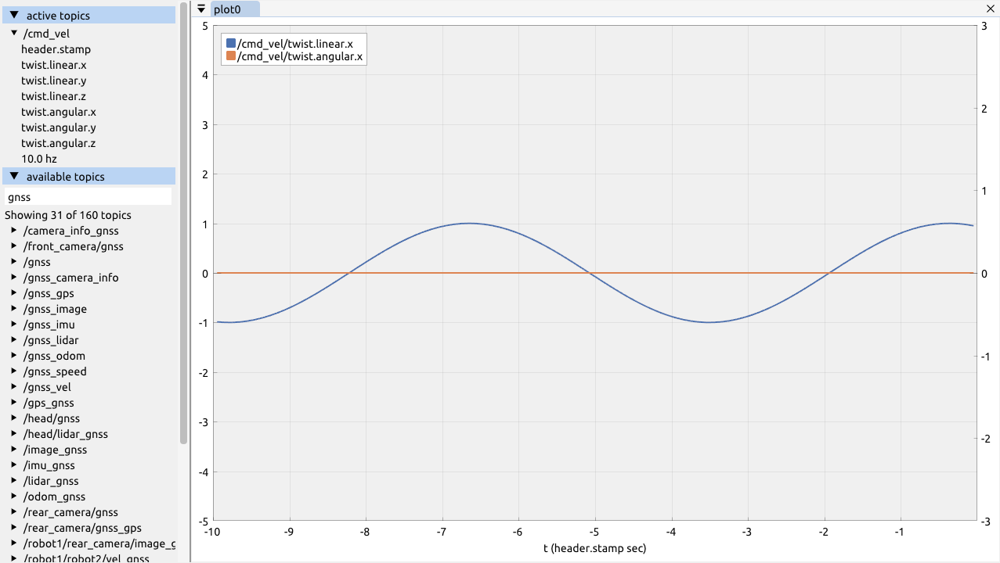

A realtime plotting tool for ROS2.



# installation

Add [imgui_vendor](https://github.com/Kettenhoax/imgui_vendor) and [implot_vendor](https://github.com/Kettenhoax/implot_vendor) to your ROS2 workspace, and build with `colcon`.
Make sure to clone the vendor packages with submodules.

# usage

```bash
ros2 run quickplot quickplot [config.yaml] [--ros-args -p use_sim_time:=true]
```

Plot config files are intended to be hand-written and source-controlled as part of a ROS project, same as Rviz configuration.

```
# example to plot speed and angular velocity of a Twist message on two axes
plots:
  - axes:
      - y_min: -2
        y_max: 2
      - y_min: -0.5
        y_max: 0.5
    sources:
      - topic_name: /cmd_vel
        member_path:
          - twist
          - linear
          - x
      - topic_name: /cmd_vel
        member_path:
          - twist
          - angular
          - z
        axis: 1
```

# planned features

* [ ] use length of geometry_msgs/msg/Vector3 as data source
* [ ] suggest auto-fit if all y values are off-plot
* [ ] show error states on topic communication in topic list
* [ ] warning about NaN values

* [ ] axis unit label suggestion (e.g. m/s for twist.linear)
* [ ] range suggestions based on suggested unit (e.g. angles -pi to pi)

* [ ] visualize covariance matrices as heatmaps

## tests

To test GUI features, use the scripts in `test` to publish example data.

* `test/publish_sim_twist.py` publishes velocity in sim time, and a sim time clock; the application should display a warning if launched with `use_sim_time:=false`

* `test/publish_real_twist.py` publishes velocity in real time, and a sim time clock; the application should display a warning if launched with `use_sim_time:=true`
* 
* `test/unknown_type` contains a Dockerfile to build an image with a message type unknown to the host system, quickplot should display a warning about a missing message type